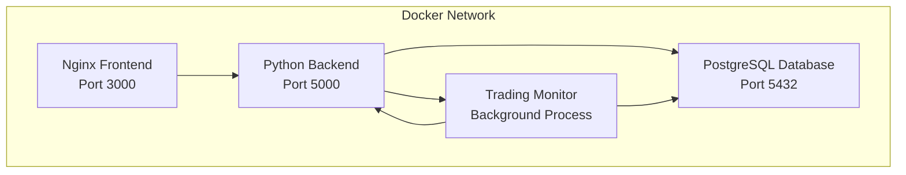

# 🐳 Smart Currency Selector - Documentação da Versão de Produção Docker

## 📖 Visão Geral

Este documento detalha a implementação completa da versão de produção do Smart Currency Selector usando Docker. A solução foi criada **sem modificar a estrutura atual do projeto**, mantendo total compatibilidade com o ambiente de desenvolvimento existente.

## 🏗️ Arquitetura da Solução

### Containers Implementados

A versão de produção utiliza uma arquitetura de microserviços com 4 containers independentes:



#### 1. **Frontend Container** (`smart-currency-frontend`)
- **Base**: `nginx:alpine`
- **Build**: Multi-stage com Node.js 18
- **Função**: Serve a aplicação React compilada
- **Porta**: 3000
- **Features**:
  - Build otimizado para produção
  - Compressão Gzip
  - Cache de assets estáticos
  - Proxy reverso para API

#### 2. **Backend Container** (`smart-currency-backend`)
- **Base**: `python:3.12-slim`
- **Servidor**: Gunicorn com múltiplos workers
- **Porta**: 5000
- **Features**:
  - Health check endpoint
  - Logs estruturados
  - Auto-scaling workers
  - Timeout configurável

#### 3. **Database Container** (`smart-currency-db`)
- **Base**: `postgres:15-alpine`
- **Porta**: 5432
- **Features**:
  - Schema automático via init.sql
  - Health checks nativos
  - Volume persistente
  - Configurações otimizadas

#### 4. **Monitor Container** (`smart-currency-monitor`)
- **Base**: `python:3.12-slim`
- **Função**: Trading automático isolado
- **Features**:
  - Processo independente
  - Restart automático
  - Health check personalizado
  - Logs dedicados

## 📁 Estrutura de Arquivos Criada

```
smart-currency-selector/
├── production/                    # 🆕 Diretório de produção
│   ├── docker-compose.yml         # Orquestração principal
│   ├── .env.example              # Template de configuração
│   ├── README.md                 # Guia de uso
│   ├── DEPLOYMENT.md             # Instruções de deploy
│   ├── dockerfiles/              # Dockerfiles otimizados
│   │   ├── Dockerfile.backend    # Backend com Gunicorn
│   │   ├── Dockerfile.frontend   # Frontend multi-stage
│   │   └── Dockerfile.monitor    # Monitor isolado
│   ├── config/                   # Configurações de produção
│   │   ├── nginx.conf           # Nginx principal
│   │   ├── default.conf         # Virtual host
│   │   └── gunicorn.conf.py     # Configuração Gunicorn
│   ├── database/                # Schema do banco
│   │   └── init.sql            # Inicialização automática
│   └── scripts/                 # Scripts de automação
│       └── deploy.sh           # Script mágico de deploy
├── .dockerignore                # 🆕 Otimização de build
└── requirements.txt             # ✏️ Adicionado Flask, CORS, Gunicorn
```

## ⚙️ Configurações Implementadas

### Docker Compose

O arquivo `docker-compose.yml` configura:

- **Rede isolada**: `smart-currency-network`
- **Volumes persistentes**: `postgres_data`, `app_logs`
- **Health checks**: Para todos os serviços críticos
- **Restart policies**: `unless-stopped` para alta disponibilidade
- **Environment variables**: Centralizadas no `.env`

### Nginx Configuration

```nginx
# Otimizações implementadas:
- Compressão Gzip para assets
- Cache de arquivos estáticos (1 ano)
- Proxy reverso para API (/api/*)
- Headers de segurança
- Health check endpoint (/health)
```

### Gunicorn Configuration

```python
# Configurações de produção:
- Workers: CPU cores × 2 + 1
- Timeout: 120 segundos
- Keep-alive: 2 segundos
- Max requests: 1000 (com jitter)
- Logging: Arquivos estruturados
```

### PostgreSQL Schema

O arquivo `init.sql` cria automaticamente:
- Todas as tabelas necessárias
- Índices otimizados
- Configurações padrão
- Triggers para timestamps
- Permissões adequadas

## 🚀 Scripts de Automação

### Deploy Script (`deploy.sh`)

Script principal com comandos inteligentes:

```bash
# Comandos disponíveis:
./scripts/deploy.sh start           # Deploy completo
./scripts/deploy.sh stop            # Parar todos os serviços
./scripts/deploy.sh restart         # Reiniciar sistema
./scripts/deploy.sh health          # Verificar saúde
./scripts/deploy.sh logs [service]  # Ver logs
./scripts/deploy.sh status          # Status do trading
./scripts/deploy.sh enable-trading  # Ativar trading
./scripts/deploy.sh disable-trading # Desativar trading
./scripts/deploy.sh update          # Atualizar containers
```

### Funcionalidades do Script

1. **Verificações automáticas**:
   - Docker e Docker Compose instalados
   - Arquivo `.env` configurado corretamente
   - Chaves obrigatórias presentes

2. **Deploy inteligente**:
   - Build sem cache quando necessário
   - Aguarda serviços ficarem prontos
   - Verifica health checks automaticamente

3. **Monitoramento**:
   - Status em tempo real
   - Logs formatados
   - Estatísticas de trading

## 🔧 Configuração de Environment

### Variáveis Obrigatórias

```bash
# APIs Externas (OBRIGATÓRIO)
DEXTOOLS_API_KEY=sua_chave_real
SOLANA_PRIVATE_KEY=sua_chave_privada

# Database (Recomendado)
DB_USER=admin
DB_PASSWORD=senha_super_segura

# Solana Network
SOLANA_RPC_URL=https://api.mainnet-beta.solana.com

# Trading Parameters
PROFIT_TARGET_PERCENTAGE=20
STOP_LOSS_PERCENTAGE=10
AUTO_TRADING_ENABLED=false
```

### Variáveis Opcionais

```bash
# Telegram (Notificações)
TELEGRAM_BOT_TOKEN=seu_bot_token
TELEGRAM_CHAT_ID=seu_chat_id

# Performance Tuning
GUNICORN_WORKERS=4
POSTGRES_MAX_CONNECTIONS=100
```

## 🛡️ Recursos de Segurança

### Implementados

1. **Isolamento de rede**: Containers em rede privada
2. **Headers de segurança**: XSS, CSRF, Content-Type
3. **Health checks**: Monitoramento automático
4. **Logs estruturados**: Auditoria completa
5. **Restart automático**: Alta disponibilidade

### Recomendados para Produção

1. **SSL/HTTPS**: Reverse proxy com certificados
2. **Firewall**: Restringir portas expostas
3. **Backup automático**: Database e logs
4. **Monitoring externo**: Prometheus/Grafana

## 📊 Monitoramento e Logs

### Health Checks Configurados

```yaml
# Backend
GET /api/health → 200 OK

# Database  
pg_isready -U admin -d smart_currency → OK

# Monitor
Conexão com database → OK
```

### Estrutura de Logs

```
/app/logs/
├── gunicorn_access.log    # Requests HTTP
├── gunicorn_error.log     # Erros do backend  
├── monitor.log            # Trading automático
└── postgres/              # Logs do database
```

### Comandos de Monitoramento

```bash
# Ver todos os logs
docker-compose logs -f

# Log específico
docker-compose logs -f monitor

# Status dos containers
docker-compose ps

# Uso de recursos
docker stats
```

## 🔄 Processo de Deploy

### 1. Preparação

```bash
cd production/
cp .env.example .env
nano .env  # Configurar chaves
```

### 2. Deploy

```bash
chmod +x scripts/deploy.sh
./scripts/deploy.sh start
```

### 3. Verificação

```bash
# Aguardar containers iniciarem (30-60s)
./scripts/deploy.sh health

# Testar endpoints
curl http://localhost:3000/health
curl http://localhost:5000/api/health
```

### 4. Ativação do Trading

```bash
# APENAS após verificar que tudo funciona
./scripts/deploy.sh enable-trading
./scripts/deploy.sh logs monitor  # Monitorar
```

## 🔍 Troubleshooting

### Problemas Comuns

#### 1. Container não inicia
```bash
# Ver logs detalhados
docker-compose logs [service_name]

# Reconstruir
docker-compose build --no-cache [service_name]
```

#### 2. Database não conecta
```bash
# Verificar status
docker-compose exec database pg_isready -U admin

# Reset completo
docker-compose down -v
docker-compose up -d
```

#### 3. API não responde
```bash
# Testar diretamente
curl -f http://localhost:5000/api/health

# Reiniciar backend
docker-compose restart backend
```

#### 4. Frontend não carrega
```bash
# Verificar build
docker-compose logs frontend

# Verificar Nginx
docker-compose exec frontend nginx -t
```

## 📈 Performance e Escalabilidade

### Configurações Atuais

- **Backend**: Gunicorn multi-worker (auto-scaling)
- **Database**: PostgreSQL com índices otimizados
- **Frontend**: Nginx com cache agressivo
- **Monitor**: Processo dedicado isolado

### Para Scaling

1. **Horizontal**: Múltiplas instâncias com load balancer
2. **Vertical**: Aumentar resources dos containers
3. **Database**: Read replicas, connection pooling
4. **CDN**: Para assets estáticos

## 🎯 Vantagens da Solução

### ✅ **Zero Impacto na Estrutura Atual**
- Projeto principal intocado
- Desenvolvimento continua igual
- Compatibilidade total

### ✅ **Production-Ready**
- Gunicorn multi-worker
- Nginx otimizado
- PostgreSQL configurado
- Health checks automáticos

### ✅ **Facilidade de Uso**
- Deploy com um comando
- Scripts inteligentes
- Documentação completa

### ✅ **Monitoramento Completo**
- Logs estruturados
- Health checks
- Status em tempo real

### ✅ **Segurança**
- Containers isolados
- Headers de segurança
- Restart automático

## 🚀 Próximos Passos

1. **Teste local** primeiro
2. **Configure** servidor de produção
3. **Setup** backup automático
4. **Monitore** performance
5. **Scale** conforme necessário

---

## 📞 Comandos de Referência Rápida

```bash
# Deploy inicial
cd production/
cp .env.example .env && nano .env
./scripts/deploy.sh start

# Monitoramento
./scripts/deploy.sh health
./scripts/deploy.sh status  
./scripts/deploy.sh logs monitor

# Trading
./scripts/deploy.sh enable-trading
./scripts/deploy.sh disable-trading

# Manutenção
./scripts/deploy.sh restart
./scripts/deploy.sh update
./scripts/deploy.sh stop
```

**Esta versão Docker mantém sua estrutura atual e fornece uma solução profissional de produção completa! 🎉**